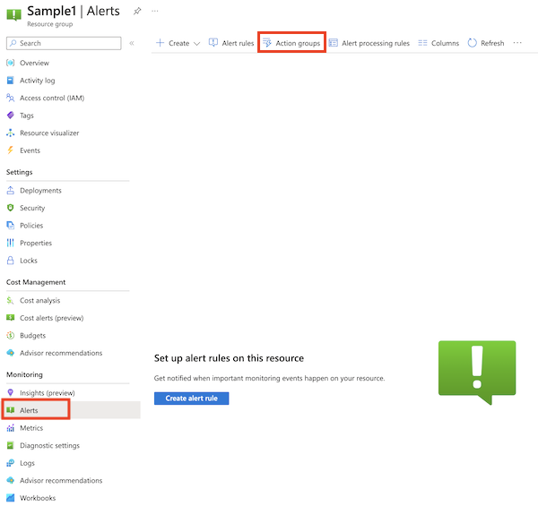
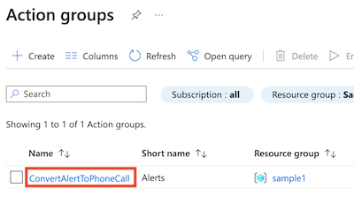
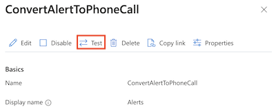
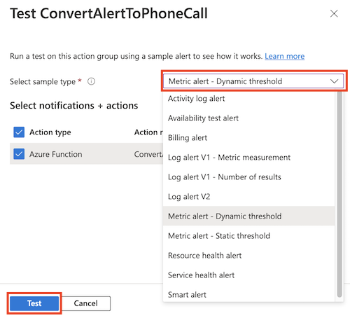

# Send Azure Monitor alerts to a phone call

This sample shows how to make an international phone call when an Azure Monitor alert is fired.

Azure Monitor supports making phone calls from alert action groups, but (as of January 2023) only to North American phone numbers. This sample uses Twilio to make a phone call to any of the countries that Twilio supports.

## Components

The sample contains two main parts:
- An Azure Function, which uses the [Twilio SDK](https://www.twilio.com/docs/libraries/csharp-dotnet) to make a phone call when it receives an HTTP POST request containing an [Azure Monitor common alert schema](https://learn.microsoft.com/azure/azure-monitor/alerts/alerts-common-schema) body.
- An Azure Monitor action group, which sends alerts to the Azure Function.

### Security

For simplicity, this sample doesn't authenticate access to the function. However, the function app is configured with [access restrictions](https://learn.microsoft.com/azure/app-service/app-service-ip-restrictions) to deny any inbound connections except from Azure Monitor's service tag.

## Run the sample

To run this sample, you need the following prerequisites installed on your local machine:

- [Azure PowerShell](https://learn.microsoft.com/powershell/azure/install-az-ps)
- [Azure Functions core tools](https://learn.microsoft.com/azure/azure-functions/functions-run-local)

### Get a Twilio account

1. Sign up for a Twilio account. You can [sign up for a free trial](https://www.twilio.com/try-twilio).

1. After signing up, note your Twilio account SID and your auth token. You need to use these later in the setup process.

1. Request a Twilio phone number. This phone number will be where your alert phone calls appear to come from in your caller ID.

1. [Verify your own phone number.](https://console.twilio.com/us1/develop/phone-numbers/manage/verified) This step is required for your trial account to make outbound phone calls to your phone number.

### Deploy the sample

1. Use PowerShell to run the `deploy/deploy.ps1` script file, and use the following parameters:

   - `-TwilioAccountSid`: Your Twilio account SID.
   - `-TwilioAuthToken`: Your Twilio auth token.
   - `-TwilioFromNumber`: The Twilio-provided phone number, which your phone calls will appear to come from.
   - `-TwilioToNumber`: Your phone number. For a Twilio trial account, ensure that you validate your phone number.
   - `-ResourceGroupName`: The name of the Azure resource group to create and use for the sample.
   - `-ResourceGroupLocation`: The location into which the Azure resource group should be created.

   If the deployment fails, re-run the `deploy/deploy.ps1` script.

### Test the action group

1. Open the Azure portal.

1. Navigate to the resource group that you used for the sample.

1. Select **Alerts**, and then select **Action groups**.

   

1. Select the **ConvertAlertToPhoneCall** action group.

   

1. Select the **Test** button.

   

1. Select a sample alert type to send to your function, then select **Test** to initiate the test.

   

   Within a few moments, you should receive a phone call.

After you've verified that your action group works correctly, you can [use it in your own alert rules](https://learn.microsoft.com/azure/azure-monitor/alerts/alerts-create-new-alert-rule).
